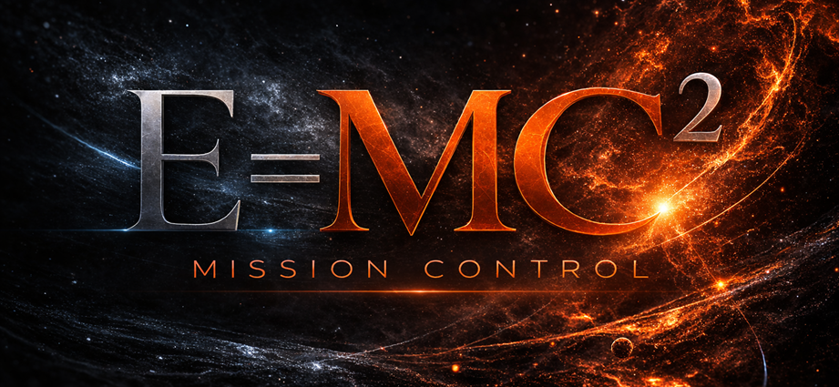

<p align="center">
  
</p>

# Mission Control - Strategic Enterprise AI Orchestration

> **The coordination layer for AI-native organizations.**

AI agents can generate production code, reason over architecture, and execute complex workflows. What they can't do is coordinate. Without a shared system of record, parallel agents duplicate effort, diverge state, and collide on artifacts.

MissionControl solves the coordination problem. It is a control plane for AI agents and human collaborators — providing structured missions, durable memory, task ownership, overlap detection, governance, and a Slack-native organizational interface.

> Kubernetes orchestrates containers. MissionControl orchestrates agents, missions, and knowledge.

## Enterprise Positioning

- **Rust-native agent gateway (`mc`)** — a single compiled binary for MCP/CLI/runtime orchestration, designed for predictable performance and reduced local attack surface.
- **Security-first control plane** — policy-gated mutations, approvals, mission-scoped permissions, session tokens (`mcs_*`), and auditable publication provenance.
- **IT-operable by design** — explicit API/MCP contracts, health endpoints, environment-driven deployment, and cloud-compatible primitives (Postgres + S3 + Git projection).
- **Built for regulated collaboration** — mission boundaries, profile isolation, and publication records help teams satisfy internal governance and change-control requirements.

## Core Capabilities

- **Missions & Klusters** — organizational units that scope knowledge, tools, permissions, and governance. Agents and humans switch profiles without losing context or integrity.
- **Overlap Detection** — fuzzy + vector similarity analysis runs before task/artifact creation to proactively reduce collisions and enable safer parallelism at scale.
- **Artifact Ledger** — every significant mutation is recorded in Postgres, indexed for search, and optionally committed to Git with full provenance metadata.
- **MCP-Native Agent Interface** — agents interact via standard MCP stdio tools (`search_tasks`, `detect_overlaps`, `load_kluster_workspace`, `publish_pending_ledger_events`). No custom SDK required.
- **Governance & Approvals** — versioned policy lifecycle (draft → active → rollback), role-based access (Admin / Contributor / Viewer), HMAC-signed approval tokens on sensitive mutations.
- **Integrations for Slack and other channels** — mission-aware notifications, task creation from threads, approval workflows, and search queries — where your team already works.
- **Semantic Search** — tasks, docs, and klusters are vector-indexed (pgvector or Chroma) for similarity and hybrid search.
- **S3-Backed File Persistence** — artifact content (docs, binaries, skill bundles) stored in S3-compatible object storage. RustFS is included in the Docker Compose stack for zero-config local persistence. Swap in any S3-compatible backend (AWS S3, MinIO, RustFS) for production.

## Architecture

```
┌──────────────────────────────────────────────────────────────┐
│              AI Agents  (Claude, Codex, custom)              │
└──────────────────────────────┬───────────────────────────────┘
                               │
               ┌───────────────▼─────────────────┐
               │               mc                │
               │     MCP stdio bridge · Rust     │
               │        cargo install mc         │
               │  tools/list · tools/call · CLI  │
               └───────────────┬─────────────────┘
                               │  HTTP
┌──────────────────────────────▼───────────────────────────────┐
│                     MissionControl API                       │
│                      FastAPI  ·  MQTT                        │
├─────────────────┬──────────────────────┬─────────────────────┤
│  Missions &     │  Tasks · Overlap     │  Governance &       │
│  Klusters       │  Detection · Semantic│  Approvals          │
│                 │  Search              │  Slack / ChatOps    │
└─────────────────┴──────────────────────┴─────────────────────┘
         │                    │                      │
         ▼                    ▼                      ▼
┌─────────────────┐  ┌─────────────────┐  ┌──────────────────┐
│   PostgreSQL    │  │   S3 / RustFS   │  │     GitHub       │
│   + pgvector    │  │  Object Store   │  │                  │
│                 │  │                 │  │  Artifact ledger │
│  Structured     │  │  Artifact       │  │  long-term       │
│  state · roles  │  │  content ·      │  │  memory of       │
│  vector index   │  │  skill bundles  │  │  record          │
│  status · collab│  │  file persist.  │  │                  │
└─────────────────┘  └─────────────────┘  └──────────────────┘
                               │
                 ┌─────────────▼──────────────┐
                 │        Human Team          │
                 │    Slack · Teams · Web UI  │
                 └────────────────────────────┘
```

## Quick Links

| | |
|---|---|
| Docker full stack (default) | `bash scripts/dev-up.sh` |
| Install mc CLI | `bash scripts/install-mc.sh` (pre-built binary or source build) |
| Philosophy & vision | [MISSIONCONTROL_PHILOSOPHY.md](MISSIONCONTROL_PHILOSOPHY.md) |
| API reference | `/api/docs` (Swagger UI, when running locally) |
| Web UI (SvelteKit) | `web/README.md` (AI Console + dashboard tabs, dev server, build, OIDC login) |
| AI Console protocol | `docs/AI-CONSOLE.md` |
| Evolve loop docs | `docs/EVOLVE.md` |

## Fastest Start (3 Commands)

```bash
bash scripts/dev-up.sh
bash scripts/install-mc.sh
MC_TOKEN="TopSecret" mc doctor
```

Optional (auto-load env on new shells):
```bash
MC_INSTALL_SHELL_HOOK=1 MC_ENV_FILE=/home/merlin/nas/code/missioncontrol/.env bash scripts/install-mc.sh
```

Then open:
- API docs: `http://localhost:8008/api/docs`
- UI: `http://localhost:8008/ui/`

## Evolve (Self-Improvement Loop)

`mc evolve` currently supports seeding evolve missions and recording/inspecting run metadata.
For the exact current behavior and limitations, see [`docs/EVOLVE.md`](docs/EVOLVE.md).

## Web UI (SvelteKit)

The `web/` directory is a standalone SvelteKit 2 application with an AI-first console landing view (chat-first transcript + prompt composer), while preserving matrix/explorer/onboarding/governance tabs. Dark mode is the default theme, with a top-right moon/sun toggle. Production login is OIDC-first via backend PKCE flow (`/auth/oidc/start` and `/auth/oidc/exchange`), while token login remains for testing. For local experimentation run `cd web && npm install && npm run dev -- --host 0.0.0.0 --port 5173`. Production (or API-bundled) usage is handled by `npm run build`, which emits static files into `web/build`; the FastAPI backend mounts that directory at `/ui/`.

AI console behavior and event contracts are documented in [`docs/AI-CONSOLE.md`](docs/AI-CONSOLE.md).

---

## Docker Dev (Recommended)

Full profile (default; Postgres + pgvector + MQTT + RustFS):

1. Start full stack:

```bash
bash scripts/dev-up.sh
```

2. Smoke test:

```bash
curl -H "Authorization: Bearer TopSecret" http://localhost:8008/
```

or run automated full-profile smoke checks:

```bash
bash scripts/smoke.sh --profile full
```

3. Stop:

```bash
bash scripts/dev-down.sh
```

### Object Storage (RustFS — included)

RustFS (S3-compatible) is bundled in both Docker Compose profiles and starts automatically. The `missioncontrol` bucket is created on first run. Object keys are scoped to `missions/{id}/klusters/{id}/...`.

Local endpoints (Docker Compose):
- S3 API: `http://localhost:9000`
- Console UI: `http://localhost:9001`

To point at an external S3-compatible backend (AWS S3, MinIO, etc.) instead, set these in `.env`:

```bash
MC_OBJECT_STORAGE_ENDPOINT=http://<host>:<port>
MC_OBJECT_STORAGE_REGION=us-east-1
MC_OBJECT_STORAGE_BUCKET=missioncontrol
MC_OBJECT_STORAGE_SECURE=false
MC_OBJECT_STORAGE_ACCESS_KEY=<key>
MC_OBJECT_STORAGE_ACCESS_SECRET=<secret>
```

Note: the compose file's built-in RustFS config takes precedence for local runs. `.env` overrides apply when pointing at an external store (remove or override the compose environment block).

Quickstart profile (local-only fast loop; SQLite + Chroma fallback):

1. Start quickstart:

```bash
MC_STACK_PROFILE=quickstart bash scripts/dev-up.sh
```

2. Stop quickstart:

```bash
MC_STACK_PROFILE=quickstart bash scripts/dev-down.sh
```

## Docker Compose (recommended)

Use the `Docker Dev (Recommended)` flow above for local compose startup, smoke checks, and shutdown.

## Quickstart (Python)

0. Create env file:

```bash
cp .env.example .env
```

Set OIDC env vars in `.env` for production login flow, and keep `MC_TOKEN` only as testing fallback.
MQTT settings are also available for agent messaging (see `.env.example`).

1. Install backend deps:

```bash
cd backend
python -m venv .venv
source .venv/bin/activate
pip install -r requirements.txt
```

2. Run the API:

Load env vars first (bash/zsh):

```bash
set -a; source .env; set +a
```

```bash
uvicorn app.main:app --reload
```

3. Open the UI:

After building the front-end (`cd web && npm run build`) the backend serves `/ui/` so you can browse `http://localhost:8008/ui/`. For active editing, run `cd web && npm run dev -- --host 0.0.0.0 --port 5173` and point your browser there instead.

## API Overview

- `GET /missions/{mission_id}/k` + `POST /missions/{mission_id}/k`
- `DELETE /missions/{mission_id}/k/{kluster_id}`
- `GET /missions` + `POST /missions` + `DELETE /missions/{mission_id}`
- `POST /missions/{mission_id}/owner` (admin only)
- `GET /missions/{mission_id}/roles` + `POST /missions/{mission_id}/roles` + `DELETE /missions/{mission_id}/roles/{subject}`
- `GET /docs` + `POST /docs` + `POST /docs/{id}/publish`
- `GET /artifacts` + `POST /artifacts` + `POST /artifacts/{id}/publish`
- `GET /tasks` + `POST /tasks` + `GET /tasks/{id}/overlaps`
- `DELETE /tasks/{id}`
- `POST /ingest/github` + `POST /ingest/drive` + `POST /ingest/slack`
- `GET /ingest/jobs` + `GET /ingest/jobs/{id}`
- `GET /search/tasks?q=...` + `GET /search/docs?q=...`
- `GET /search/klusters?q=...`
- `GET /schema-pack`
- `GET /explorer/tree` + `GET /explorer/node/{node_type}/{node_id}`
- `GET /agent-onboarding.json` (machine-readable agent activation manifest)
- `GET /governance/policy/active` (effective governance policy)
- `POST /governance/policy/drafts` + publish/rollback admin endpoints
- `POST /approvals/requests` + `GET /approvals` + approve/reject endpoints
- `POST /integrations/slack/events` + `POST /integrations/slack/commands` + `POST /integrations/slack/interactions`
- `POST /integrations/chat/bindings` + `GET /integrations/chat/bindings` + `DELETE /integrations/chat/bindings/{id}`
- `POST /integrations/google-chat/events` (provider skeleton)
- `POST /integrations/teams/events` (provider skeleton)
- `POST /integrations/slack/bindings` + `GET /integrations/slack/bindings` + `DELETE /integrations/slack/bindings/{id}`
- `POST /feedback/agent` + `POST /feedback/human` + `GET /feedback?mission_id=...` + `PATCH /feedback/{id}/triage` + `GET /feedback/summary?mission_id=...`
- `GET /mcp/health` + `GET /mcp/tools` + `POST /mcp/call`
- `GET /ops/metrics` (platform admin only)
- `GET /ops/logs?limit=200` (platform admin only)
- `GET /me/profiles` + `POST /me/profiles`
- `GET /me/profiles/{name}` + `PUT /me/profiles/{name}` + `PATCH /me/profiles/{name}` + `DELETE /me/profiles/{name}`
- `GET /me/profiles/{name}/download` + `POST /me/profiles/{name}/activate`
- `POST /evolve/missions` + `POST /evolve/missions/{id}/run` + `GET /evolve/missions/{id}/status`
- `POST /ai/sessions` + `GET /ai/sessions` + `GET /ai/sessions/{id}` + `POST /ai/sessions/{id}/turns`
- `POST /ai/sessions/{id}/actions/{action_id}/approve` + `POST /ai/sessions/{id}/actions/{action_id}/reject`
- `GET /ai/sessions/{id}/stream`

All API responses include an `x-request-id` header for correlation and tracing.
Set `MC_LOG_EXPORT_PATH=/abs/path/missioncontrol.jsonl` to export structured events as JSON lines.

## Agent Integration

### Launch any agent with one command

Install `mc`:

```bash
bash <(curl -fsSL https://raw.githubusercontent.com/missioncontrol-ai/missioncontrol/main/scripts/install-mc.sh)
```

Then launch:

```bash
export MC_TOKEN="<your-token>"
export MC_BASE_URL="https://your-mc.example.com"

mc launch claude    # Claude Code — writes ~/.claude.json
mc launch codex     # OpenAI Codex CLI — appends ~/.codex/config.toml
mc launch gemini    # Google Gemini CLI — writes ~/.gemini/settings.json
mc launch openclaw  # OpenClaw — writes ~/.missioncontrol/config/openclaw.acp.json
```

`mc launch` auto-starts the daemon, validates auth, writes agent config, and exec's the agent.

Use `mc login` to create a server-issued session token (`mcs_*`) stored locally — no more
token in agent config files, revocable any time, auto-loaded by `mc` on next run:

```bash
MC_TOKEN="<static-token>" mc login   # exchange for session token
mc launch claude                     # session auto-loaded, token injected at exec
mc whoami                            # verify identity
mc logout                            # revoke session
```

Pass `--preflight-only` to validate without launching (useful in CI).
Pass `-- <args>` to forward arguments to the agent binary.

For manual setup, session token details, Codex swarm workflows, and skill sync: see [`docs/AGENT-INSTALL.md`](docs/AGENT-INSTALL.md).

- **Rust CLI (`mc`) first:** see `integrations/mc/README.md` for installation, daemon, governance, tooling, sync, and matrix telemetry commands; the CLI mirrors the HTTP/MCP surface described elsewhere in this README and is the recommended interface for most OSS users.
- **Agent configs & doctor:** use `scripts/generate-agent-config.sh` to emit MCP onboarding manifests and run `mc doctor` (preferred) to validate connectivity before handing configs to Codex/Claude/Gemini.
- **Codex multi-session swarms:** follow `docs/CODEX-SWARM-WORKFLOW.md` for first-class collaborative runs without nested `codex exec`.
- **Auth modes:** API accepts `token`, `oidc`, or `dual` via `AUTH_MODE`. `mc login` issues server-side session tokens (`mcs_*`) that work across all auth modes, are revocable, and never need to be written to agent config files.

## MCP Examples

```bash
curl http://localhost:8008/mcp/tools
```

```bash
curl -X POST http://localhost:8008/mcp/call -H "Content-Type: application/json" -d '{"tool":"search_klusters","args":{"query":"marketing"}}'
```

```bash
curl -X POST http://localhost:8008/mcp/call -H "Content-Type: application/json" -d '{"tool":"search_tasks","args":{"query":"overlap detection","limit":5}}'
```

```bash
curl -X POST http://localhost:8008/mcp/call -H "Content-Type: application/json" -d '{"tool":"load_kluster_workspace","args":{"kluster_id":"<kluster-id>"}}'
```

## Ingestion Examples

```bash
curl -X POST http://localhost:8008/ingest/github -H "Content-Type: application/json" -d '{"cluster_id":"abc123def456","config":{"repo":"org/repo"}}'
```

```bash
curl http://localhost:8008/ingest/jobs?cluster_id=abc123def456
```

## Mission-Scoped Git Persistence

`POST /artifacts/{id}/publish` marks artifacts as `published`, enqueues ledger provenance,
and executes mission-routed Git publication.

Publication is now policy-routed (not global env routed):
- Configure repository targets via `/persistence/connections` and `/persistence/bindings`.
- Configure mission routing via `/persistence/missions/{mission_id}/policy`.
- Resolve targets before publish with MCP `resolve_publish_plan`.
- Execute mission publish with MCP `publish_pending_ledger_events`.
- Inspect results with MCP `get_publication_status`.

Core model:
- Postgres is coordination source-of-truth.
- S3-compatible storage keeps active artifact/document bytes.
- Git is explicit projection/memory-of-record with commit provenance in `publication_records`.

## Search Examples

```bash
curl "http://localhost:8008/search/tasks?q=roadmap"
```

```bash
curl "http://localhost:8008/search/docs?q=architecture"
```

```bash
curl "http://localhost:8008/search/klusters?q=mission"
```

## DB Migrations

Alembic is available for forward schema migrations:

```bash
cd backend
alembic upgrade head
```

Migration CI workflow: `.github/workflows/ci-migrations.yml`

Release procedure checklist: `docs/RELEASE-UPGRADE-CHECKLIST.md`

## Tests

Run the repo test suites (backend + MCP bridge package) from repo root:

```bash
bash scripts/test.sh
```

## Schema Packs

- Default schema pack file: `docs/schema-packs/main.json`
- Alternative example: `docs/schema-packs/alternative-product.json`
- Override active pack with env var `MC_SCHEMA_PACK_FILE=/abs/path/to/pack.json`

## Governance Policy

- Governance policy is DB-backed and versioned (`draft` -> `active`).
- Admin UI tab (`/ui` -> Admin) supports viewing/editing/publishing policy.
- Optional conservative preset:
  - `MC_GOV_PROFILE=production` (forces mutation approvals and disables mutation via MCP/terminal by default)
- Optional env overrides (highest precedence):
  - `MC_GOV_REQUIRE_APPROVAL_FOR_MUTATIONS`
  - `MC_GOV_ALLOW_CREATE_WITHOUT_APPROVAL`
  - `MC_GOV_ALLOW_UPDATE`
  - `MC_GOV_ALLOW_DELETE`
  - `MC_GOV_ALLOW_PUBLISH`
  - `MC_GOV_MCP_ALLOW_MUTATION_TOOLS`
  - `MC_GOV_TERMINAL_ALLOW_CREATE_ACTIONS`
  - `MC_GOV_TERMINAL_ALLOW_PUBLISH_ACTIONS`
  - `MC_APPROVAL_TOKEN_SECRET`
  - `MC_ALLOW_LEGACY_APPROVAL_CONTEXT`

Approval token header:
- `x-approval-token` (HMAC-signed payload with `request_id`, `approved_by`, `approved_at`, `exp`, `nonce`)
- mutation responses include trace headers when approval is used:
  - `x-approval-request-id`

## Slack Outbound Notifications

- Configure `SLACK_BOT_TOKEN` to enable MissionControl event notifications into bound Slack channels.
- Slack channel bindings are now provider-aware and default to `provider=slack`.
- New provider-agnostic bindings API is available at `/integrations/chat/bindings`; Slack binding endpoints are preserved for compatibility.

## Google Chat Provider Skeleton

- Configure `GOOGLE_CHAT_VERIFICATION_TOKEN` for inbound event verification.
- Reuse bindings API with `provider=google_chat`.
- For outbound notifications, set binding `channel_metadata.webhook_url` to a Google Chat incoming webhook URL.

## Teams Provider Skeleton

- Configure `TEAMS_VERIFICATION_TOKEN` for inbound event verification.
- Reuse bindings API with `provider=teams`.
- For outbound notifications, set binding `channel_metadata.webhook_url` to a Teams incoming webhook URL.
  - `x-approval-nonce`
- optional event sink for approval lifecycle notifications:
  - `MC_NOTIFICATION_WEBHOOK_URL`
- Slack request verification:
  - `SLACK_SIGNING_SECRET`
  - `SLACK_SIGNATURE_TOLERANCE_SEC`
- Slack role mapping for ChatOps:
  - map Slack users to mission roles via subjects in format `slack:<SLACK_USER_ID>`

## Notes

- Docker default database is Postgres (`pgvector/pgvector:0.8.2-pg18` image).
- Set CORS allowlist via `MC_CORS_ALLOW_ORIGINS` (comma-separated origins).
- Default vector store is pgvector when using Postgres.
- Quickstart fallback database remains SQLite (`backend/taskman.db`) with Chroma (`backend/chroma`) vector fallback.
- You can force vector backend with `VECTOR_STORE_BACKEND=pgvector|chroma`.
- Embeddings are deterministic hash-based; replace with OpenAI/Claude/Ollama adapters.
- Overlap detection uses both fuzzy similarity and vector search.
- Ingestion endpoints enqueue stub jobs and create a placeholder doc.

## License and Trademark

- License: Apache-2.0 (`LICENSE`)
- Notice: `NOTICE`
- Trademark usage: `TRADEMARK_POLICY.md`

## Contributing and Community

- Contribution guide: `CONTRIBUTING.md`
- Code of conduct: `CODE_OF_CONDUCT.md`
- Security reporting: `SECURITY.md`
- Support boundaries: `SUPPORT.md`
- Project governance: `GOVERNANCE.md`

## Open Core and Public Readiness

- Open core model: `docs/OPEN-CORE-MODEL.md`
